# Things

<table align="center">
  <tr>
    <td align="center" width="200">
      <a href="https://github.com/likeablob/opencode-walkie-talkie">
        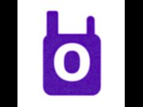 
        <b>opencode-walkie-talkie</b>
      </a>
    </td>
    <td align="center" width="200">
      <a href="https://github.com/likeablob/cydintosh">
        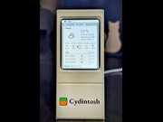 
        <b>cydintosh</b>
      </a>
    </td>
    <td align="center" width="200">
      <a href="https://github.com/likeablob/substrate-esp32-p4">
        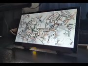 
        <b>substrate-esp32-p4</b>
      </a>
    </td>
    <td align="center" width="200" style="vertical-align: middle;">
      <a href="https://github.com/likeablob/parakeet-api">
        

          📁
        

        <b>parakeet-api</b>
      </a>
    </td>
  </tr>
  <tr>
    <td align="center" width="200">
      <a href="https://github.com/likeablob/denki-kurage">
        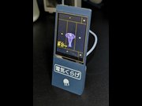 
        <b>denki-kurage</b>
      </a>
    </td>
    <td align="center" width="200">
      <a href="https://github.com/likeablob/substrate-pixi">
         
        <b>substrate-pixi</b>
      </a>
    </td>
    <td align="center" width="200">
      <a href="https://github.com/likeablob/push-to-whisper">
        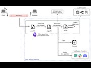 
        <b>push-to-whisper</b>
      </a>
    </td>
    <td align="center" width="200">
      <a href="https://github.com/likeablob/cat-nyaight-light">
         
        <b>cat-nyaight-light</b>
      </a>
    </td>
  </tr>
  <tr>
    <td align="center" width="200">
      <a href="https://github.com/likeablob/spin-maru">
        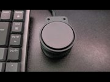 
        <b>spin-maru</b>
      </a>
    </td>
    <td align="center" width="200">
      <a href="https://github.com/likeablob/mini-media-control-bar">
        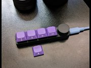 
        <b>mini-media-control-bar</b>
      </a>
    </td>
    <td align="center" width="200">
      <a href="https://github.com/likeablob/tenki-hari">
         
        <b>tenki-hari</b>
      </a>
    </td>
    <td align="center" width="200">
      <a href="https://github.com/likeablob/pizza-clock">
        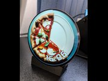 
        <b>pizza-clock</b>
      </a>
    </td>
  </tr>
  <tr>
    <td align="center" width="200">
      <a href="https://github.com/likeablob/infinite-mucha-esque-scroll">
         
        <b>infinite-mucha-esque-scroll</b>
      </a>
    </td>
    <td align="center" width="200" style="vertical-align: middle;">
      <a href="https://github.com/likeablob/pulumi-oci-vm-stack">
        

          📁
        

        <b>pulumi-oci-vm-stack</b>
      </a>
    </td>
    <td align="center" width="200">
      <a href="https://github.com/likeablob/slow-movie-player-7c">
        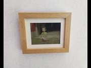 
        <b>slow-movie-player-7c</b>
      </a>
    </td>
    <td align="center" width="200" style="vertical-align: middle;">
      <a href="https://github.com/likeablob/owon-bdm-webui">
        

          📁
        

        <b>owon-bdm-webui</b>
      </a>
    </td>
  </tr>
  <tr>
    <td align="center" width="200">
      <a href="https://github.com/likeablob/endless-endless-eight">
        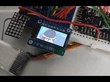 
        <b>endless-endless-eight</b>
      </a>
    </td>
    <td align="center" width="200">
      <a href="https://github.com/likeablob/kagedourou">
        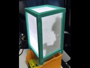 
        <b>kagedourou</b>
      </a>
    </td>
    <td align="center" width="200">
      <a href="https://github.com/likeablob/cyber-kamen">
        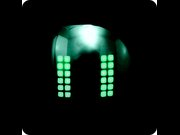 
        <b>cyber-kamen</b>
      </a>
    </td>
    <td align="center" width="200">
      <a href="https://github.com/likeablob/HDMI-A2C">
        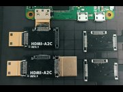 
        <b>HDMI-A2C</b>
      </a>
    </td>
  </tr>
  <tr>
    <td align="center" width="200">
      <a href="https://github.com/likeablob/rpi-wfh-webcam">
         
        <b>rpi-wfh-webcam</b>
      </a>
    </td>
    <td align="center" width="200">
      <a href="https://github.com/likeablob/misc-printable-accessories">
        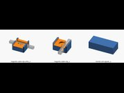 
        <b>misc-printable-accessories</b>
      </a>
    </td>
    <td align="center" width="200">
      <a href="https://github.com/likeablob/mlighter">
        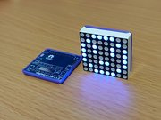 
        <b>mlighter</b>
      </a>
    </td>
    <td align="center" width="200">
      <a href="https://github.com/likeablob/macmini">
        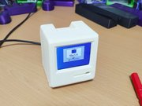 
        <b>macmini</b>
      </a>
    </td>
  </tr>
  <tr>
    <td align="center" width="200">
      <a href="https://github.com/likeablob/miniDenko">
        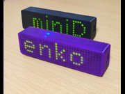 
        <b>miniDenko</b>
      </a>
    </td>
    <td align="center" width="200">
      <a href="https://github.com/likeablob/shihen">
        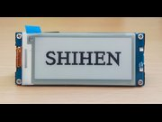 
        <b>shihen</b>
      </a>
    </td>
    <td align="center" width="200">
      <a href="https://github.com/likeablob/magnetic-towel-holder">
        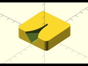 
        <b>magnetic-towel-holder</b>
      </a>
    </td>
    <td align="center" width="200">
      <a href="https://github.com/likeablob/vizinga">
         
        <b>vizinga</b>
      </a>
    </td>
  </tr>
  <tr>
    <td align="center" width="200">
      <a href="https://github.com/likeablob/google-home-mini-wall-mount">
        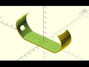 
        <b>google-home-mini-wall-mount</b>
      </a>
    </td>
    <td align="center" width="200">
      <a href="https://github.com/likeablob/parametric-stackable-box">
        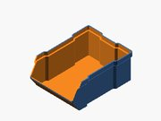 
        <b>parametric-stackable-box</b>
      </a>
    </td>
  </tr>
</table>

